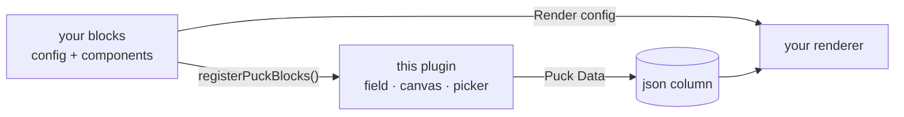
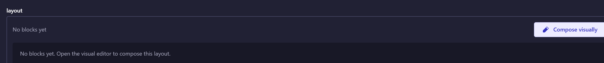
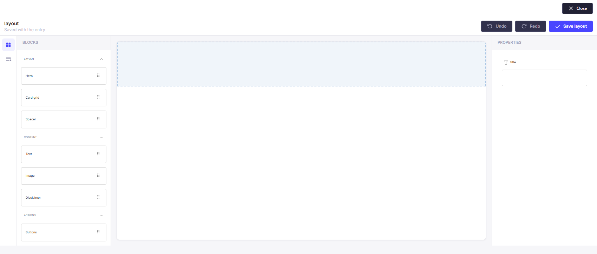
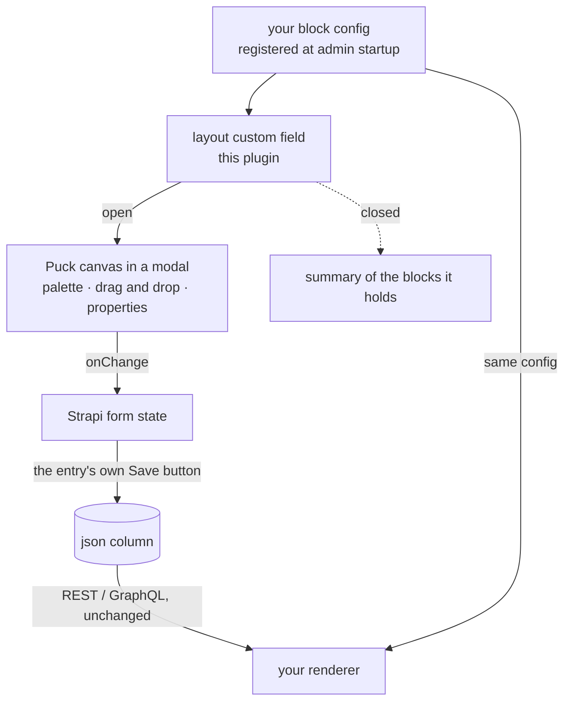

# strapi-plugin-puck

[](https://www.npmjs.com/package/strapi-plugin-puck)     

Visual block composition for Strapi 5, powered by [Puck](https://puckeditor.com).

It ships as a **custom field** you can add to any content-type — an Article, a campaign, a
landing page — plus a ready-made `Page` type for when you just want a page builder.
Composing blocks is a capability, not a content-type; tying it to one would mean
re-modelling content just to lay it out visually.

One of a family of standalone Strapi 5 plugins — see [the others](https://github.com/rhyoharianja?tab=repositories).

## Install

```bash
pnpm add strapi-plugin-puck @measured/puck
```

```ts
// config/plugins.ts
export default {
  'puck': { enabled: true, resolve: 'strapi-plugin-puck' },
};
```

> **Keep the key `puck` exactly as it is.** It is the plugin id, and the id is
> compiled into the package — the admin menu link, the `plugin::puck.*`
> custom-field uids, the route prefix and every internal `strapi.plugin(...)` lookup.
> Renaming it does not rename those, so the plugin half-loads and fails in ways that do
> not look like a naming problem. `resolve` points at the package; the key does not.

Then register **your** blocks from the admin entry:

```tsx
// src/admin/app.tsx
import { registerPuckBlocks } from 'strapi-plugin-puck/strapi-admin';
import { config, IMAGE_FIELDS } from './puck/blocks';   // your own blocks

export default {
  register() {
    registerPuckBlocks({ config, assetFields: IMAGE_FIELDS });
  },
};
```

## This plugin ships no blocks

**A block is a front-end component.** It changes when your design system changes, and the set of
blocks a site needs is specific to that site. A CMS plugin that bundled its own blocks would be
dictating your front end — and every project would then either accept blocks it did not want or
fork the plugin.

So the split is:

| Owned by the plugin | Owned by your project |
| ------------------- | --------------------- |
| The custom field and its closed-state summary | The Puck `Config` — blocks and their components |
| The canvas: palette, outline, properties, toolbar | Which fields hold images (`assetFields`) |
| The Media Library picker, and swapping it into image fields | The public renderer |
| Reading the `json` column defensively (`toLayout`) | |
| The `ImageRef` contract the picker writes | |

The config you register is the **same object** your renderer imports, which is what keeps the
editor and the site drawing the same thing. If nothing is registered the field still renders and
says so plainly, rather than crashing the edit form.



## The custom field

Add it in the Content-Type Builder, or straight in a schema:

```jsonc
// src/api/article/content-types/article/schema.json
"layout": {
  "type": "customField",
  "customField": "plugin::puck.layout"
}
```



Open it and the canvas shows **your** blocks, grouped by whatever categories your config
declares — the plugin contributes none of these names:



That is all. The field then renders:

- **closed** — a live preview drawn with the *real* block components, plus a summary of the
  blocks it holds. It doubles as a preview of what the site will show, without leaving the
  edit view;
- **open** — the full Puck canvas in a near-viewport modal: block palette, drag and drop,
  properties panel.

Stored as plain `json`, so nothing else has to know the field is special: existing REST and
GraphQL responses carry the layout as-is, and any renderer feeds it to Puck's `Render`.

## How the pieces fit



The layout is written into the **form**, never straight to the API, so it is saved by the same
Save button as every other field. Publishing a layout while the fields around it stayed unsaved
would be worse than having no editor.

Only the **layout JSON** crosses the wire — `{ "type": "Hero", "props": { … } }`. That string
`"Hero"` is all the database holds; something has to map it to a component, and both the editor
and the site need that same mapping. That is why the config is yours and is registered in both
places, rather than shipped by the plugin.

One entry point: the custom field. It opens `PuckEditor` in an overlay from wherever the
field appears, so an Article and a Page get the identical canvas without either being a
special case.

Only the **layout JSON** crosses the wire. The renderer already holds the block components,
imported from the same package the editor uses — which is what guarantees the site and the
editor agree.

## The `page` content-type

| Field | Notes |
| ----- | ----- |
| `title` | |
| `slug` | Generated from the title, de-duplicated with `-2`, `-3`, … |
| `description` | Used as the page's meta description |
| `published` | Gates the public endpoint |
| `layout` | `plugin::puck.layout` — Puck's `Data` document, stored verbatim as JSON |

`layout` uses this plugin's own custom field, so the Content Manager shows the visual
editor rather than raw JSON.

**Its shape is deliberately opaque to Strapi.** It belongs to the block config in
`puck-blocks`; modelling it as Strapi components would freeze it, and adding a block would
then need a schema migration instead of a package release.

`published` is a plain boolean rather than Strapi's draft/published, so the editor toolbar
controls visibility directly without a second publication concept to reason about.

> Strapi's `uid` field only auto-generates inside the Content Manager UI, not through the
> Document Service — so the service slugifies titles itself. Otherwise every caller would
> have to slugify, and they would each do it differently.

## Admin: no menu, no page of its own

**The editor is reached from the thing it edits, and nowhere else.** Open a Page — or an
Article, or anything else carrying the `layout` field — in the **Content Manager**, and the
field opens the canvas.

The plugin used to add a "Puck" entry to the sidebar with its own list of pages and a
full-screen editor route. Both were removed: the list duplicated what the Content Manager
already shows, and the editor route duplicated what the field already opens. A visual editor
is not a section of the admin, it is a way of editing a field.

Its admin CRUD routes went with those pages. They had no remaining caller and carried
`policies: []`, so leaving them would have been an unguarded surface for no benefit. The
Content Manager reads and writes the `page` content-type through its own generic endpoints.

> The `page` service still exposes `list`, `findOne`, `create`, `update`, `delete` and
> `uniqueSlug` for other plugins and for the Strapi console — a plugin's service is a public
> API, so those were kept even though only `findBySlug` now has an internal caller.

## API

| Method | Route | Auth |
| ------ | ----- | ---- |
| GET | `/api/puck/pages/:slug` | **Public** |

The public route is unauthenticated because a composed page is published content — and the
service only ever returns pages whose `published` flag is set. An unpublished slug is a
`404`, not a `403`, so a draft's existence is not leaked.

```jsonc
// GET /api/puck/pages/spring-campaign
{
  "data": {
    "title": "Spring campaign",
    "slug": "spring-campaign",
    "description": "This season's offer, explained on one page.",
    "published": true,
    "layout": { "root": { "props": {} }, "content": [ /* blocks */ ] }
  }
}
```

## Rendering it

A renderer is about thirty lines: fetch the entry, hand the stored JSON to Puck's `<Render>`
with the **same config** you registered in the admin. That sameness is the whole point — the
editor and the site draw from one object, so a block cannot render differently in the two.

Import the storage contract from `strapi-plugin-puck/shared` rather than re-deriving it:

```ts
import { toLayout, imageUrlOf, imageAltOf, type ImageRef } from 'strapi-plugin-puck/shared';

const page = await fetch(`${API}/api/puck/pages/${slug}`).then((r) => r.json());

<Render config={config} data={toLayout(page.data.layout)} />;
```

Nothing in that entry point imports Strapi, React or `@measured/puck` at runtime — the Puck
import is `import type` and is erased — so it is safe in a browser bundle, a server renderer
or an edge function.

**Why it is worth importing rather than writing yourself.** Both functions encode decisions the
plugin already made when it wrote the column:

- `toLayout` never assumes the value is valid. A `json` column hands its contents back as a
  *string* once the entry has been touched in the admin, and it can also come back `null` or
  missing `content`. Each of those degrades to an empty layout instead of throwing — in a
  field renderer, a throw blanks the whole edit form.
- `imageUrlOf` / `imageAltOf` read `ImageRef`, which is a union on purpose: layouts saved before
  there was an asset picker hold a plain URL string, and those rows are live.

A renderer that re-implements these has a second opinion about what a stored layout means. The
two agree until the day they do not, and the failure is silent: the admin keeps showing the page
correctly while the site renders it blank.

## Support

These plugins are free and MIT-licensed. If one saved you a day of work, you are welcome to
say thanks:

[](https://www.paypal.com/paypalme/sgkharianja)
[](https://saweria.co/rhioharianja)

Bug reports and pull requests are worth just as much.

## License

MIT © Suryo Galih Kencana Harianja
